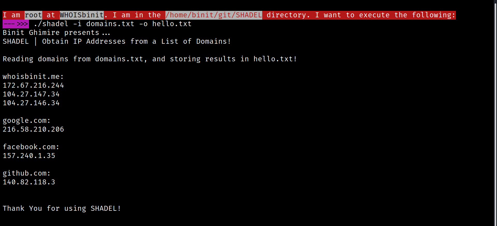

<h1 align="center" style="font-size:36px;font-weight:bold;">
    SHADEL
</h1>
<h4 align="center">
    <strong>Powered by BINIT GHIMIRE (<a href='https://twitter.com/WHOISbinit' target="_blank">@WHOISbinit</a>)</strong>
</h4>

    

<h4 align="center">
	Obtain IP Addresses from a List of Domains!
</h4>

## Installation

1. **`git clone https://github.com/TheBinitGhimire/SHADEL`**
2. **`cd SHADEL`**
3. **`cp shadel.sh shadel`**
4. **`chmod +x shadel`**

## Usage

### **`./shadel -i [INPUT] -o [OUTPUT]`**

### Usage Examples

1. Read from *domains.txt*, write into *output.txt*: **`./shadel -i domains.txt`**
2. Read from *domains.txt*, write into *myfile.txt*: **`./shadel -i domains.txt -o myfile.txt`**

## FAQs

1. How to use **SHADEL** as a command?

**=>** After making the '**shadel**' file executable with `chmod +x shadel`, you can perform **`cp shadel /usr/local/sbin/`**. Doing this will send the file to a location pre-defined in the path variables, due to which you will be able to run **SHADEL** just with `shadel -i [INPUT] -o [OUTPUT]` without being in the cloned/installation directory.

## Feature Requests

    

If you are interested in contributing in the development of <strong>SHADEL</strong>, you can feel free to create a <strong>Pull Request</strong> with modifications in the original code, or you shall open up a new <strong>issue</strong>, and I will try to include the feature as requested.

There is no restriction on anyone for contributing to the development of <strong>SHADEL</strong>. If you would like to contribute, you can feel free to do so.

<strong>~~~ ___***___~~~</strong>

